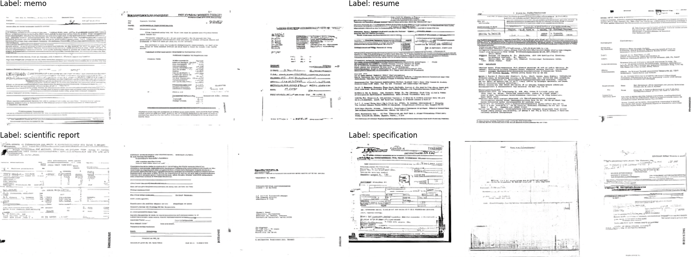
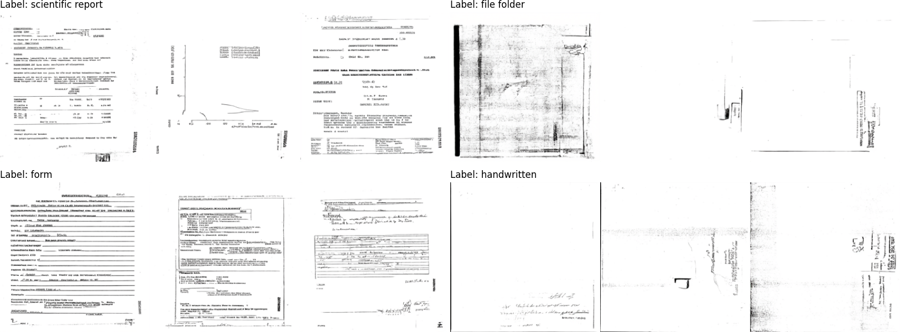

## DP-DocLDM: Differentially Private Document Image Generation using Latent Diffusion Models
This repository contains the datasets and code for the paper [DP-DocLDM: Differentially Private Document Image Generation using Latent Diffusion Models] by Saifullah Saifullah, Stefan Agne, Andreas Dengel, and Sheraz Ahmed.
Requires Python 3+. For evaluation, please download the data from the links below.


## Example generated results
Samples generated with privacy for RVL-CDIP (eps=1):


Samples generated with privacy for RVL-CDIP (eps=10):

## Environment setup
Install uv astral from following the guide: https://docs.astral.sh/uv/getting-started/installation/

Install project dependencies and activate the environment
```
uv sync
source ./.venv/bin/activate
```

## Experiments
Run individual experiments for each type of training/evaluation
### Pretraining on IIT-CDIP
#### 1. Unconditional training on unaugmented IIT-CDIP dataset with KL-F4 VAE:
```
./scripts/experiments/iitcdip_pretraining/unaugmented_dataset/pretrain_kl_f4.sh
```
Generates results in the output directory
```
./output/atria_trainer/IitCdip/iitcdip_unaug_pretraining_klf4
```
#### 2. Unconditional training on unaugmented IIT-CDIP dataset with stable-diffusion V1.4 VAE:
```
./scripts/experiments/iitcdip_pretraining/unaugmented_dataset/pretrain_sbv1.4.sh
```
Generates results in the output directory:
```
./output/atria_trainer/IitCdip/iitcdip_unaug_pretraining_sbv1.4
```
#### 3. Unconditional training on augmented IIT-CDIP dataset with KL-F4 VAE:
```
./scripts/experiments/iitcdip_pretraining/augmented_dataset/pretrain_kl_f4.sh
```
Generates results in the output directory:
```
./output/atria_trainer/IitCdip/iitcdip_aug_pretraining_klf4
```
#### 4. Unconditional training on augmented IIT-CDIP dataset with stable-diffusion V1.4 VAE:
```
./scripts/experiments/iitcdip_pretraining/augmented_dataset/pretrain_sbv1.4.sh
```
Generates results in the output directory (final FID scores are logged in tensorboard):
```
./output/atria_trainer/IitCdip/iitcdip_aug_pretraining_sbv1.4
```
#### 5. Class-Conditional training on unaugmented IIT-CDIP dataset with KL-F4 VAE:
```
./scripts/experiments/iitcdip_pretraining/unaugmented_dataset_class_cond/pretrain_kl_f4.sh
```
Generates results in the output directory (final FID scores are logged in tensorboard):
```
./output/atria_trainer/IitCdip/iitcdip_unaug_class_cond_pretraining_klf4
```
#### 6. Class-Conditional training on unaugmented IIT-CDIP dataset with stable-diffusion V1.4 VAE:
```
./scripts/experiments/iitcdip_pretraining/unaugmented_dataset_class_cond/pretrain_sbv1.4.sh
```
Generates results in the output directory (final FID scores are logged in tensorboard):
```
./output/atria_trainer/IitCdip/iitcdip_unaug_class_cond_pretraining_sbv1.4
```
#### 7. Class+Layout-Conditional training on unaugmented IIT-CDIP dataset with KL-F4 VAE:
```
./scripts/experiments/iitcdip_pretraining/unaugmented_dataset_layout_cond/pretrain_kl_f4.sh
```
Generates results in the output directory (final FID scores are logged in tensorboard):
```
./output/atria_trainer/IitCdip/iitcdip_unaug_layout_cond_pretraining_klf4
```
#### 8. Class+Layout-Conditional training on unaugmented IIT-CDIP dataset with stable-diffusion V1.4 VAE:
```
./scripts/experiments/iitcdip_pretraining/unaugmented_dataset_layout_cond/pretrain_sbv1.4.sh
```
Generates results in the output directory (final FID scores are logged in tensorboard):
```
./output/atria_trainer/IitCdip/iitcdip_unaug_layout_cond_pretraining_sbv1.4
```

### Private training on RVL-CDIP using standard DPDM/DP-promise
#### 1. Run per-label training of RVL-CDIP with layout conditioning
This script trains a single diffusion model for each document class (16 classes) using layout-conditioning and layout-conditioned pre-trained IIT-CDIP models.
```
./scripts/experiments/rvlcdip_final/experiment_configs_layout_1.sh # for eps-1
./scripts/experiments/rvlcdip_final/experiment_configs_layout_5.sh # for eps-1
./scripts/experiments/rvlcdip_final/experiment_configs_layout_10.sh # for eps-1
```
Generates results in the output directories:
```
./output/atria_trainer/RvlCdip/rvlcdip_final_dp_unaug_layout_cond_klf4_cfg_per_label_eps_1 # output dir
./output/atria_trainer/RvlCdip/rvlcdip_final_dp_unaug_layout_cond_klf4_cfg_per_label_eps_1/n/samples/DDPMScheduler/samples.msgpack # samples generated after the run
./output/atria_trainer/RvlCdip/rvlcdip_final_dp_unaug_layout_cond_klf4_cfg_per_label_eps_5
rvlcdip_final_dp_unaug_layout_cond_klf4_cfg_per_label_eps_5/n/samples/DDPMScheduler/samples.msgpack # samples generated after the run
./output/atria_trainer/RvlCdip/rvlcdip_final_dp_unaug_layout_cond_klf4_cfg_per_label_eps_10
rvlcdip_final_dp_unaug_layout_cond_klf4_cfg_per_label_eps_10/n/samples/DDPMScheduler/samples.msgpack # samples generated after the run
```

#### 2. Run the classification step
This script trains each classifier on the final generated samples
```
./scripts/experiments/rvlcdip_final/train_classifier.sh
```

### Private training on Tobacco3482 using standard DPDM/DP-promise
#### 1. Run per-label training of Tobacco3482 with layout conditioning
This script trains a single diffusion model for each document class (16 classes) using layout-conditioning and layout-conditioned pre-trained IIT-CDIP models.
```
./scripts/experiments/tobacco3482_final/experiment_configs_layout_1.sh # for eps-1
./scripts/experiments/tobacco3482_final/experiment_configs_layout_5.sh # for eps-1
./scripts/experiments/tobacco3482_final/experiment_configs_layout_10.sh # for eps-1
```
Generates results in the output directories:
```
./output/atria_trainer/tobacco3482/tobacco3482_final_dp_unaug_layout_cond_klf4_cfg_per_label_eps_1 # output dir
./output/atria_trainer/tobacco3482/tobacco3482_final_dp_unaug_layout_cond_klf4_cfg_per_label_eps_1/n/samples/DDPMScheduler/samples.msgpack # samples generated after the run
./output/atria_trainer/tobacco3482/tobacco3482_final_dp_unaug_layout_cond_klf4_cfg_per_label_eps_5
tobacco3482_final_dp_unaug_layout_cond_klf4_cfg_per_label_eps_5/n/samples/DDPMScheduler/samples.msgpack # samples generated after the run
./output/atria_trainer/tobacco3482/tobacco3482_final_dp_unaug_layout_cond_klf4_cfg_per_label_eps_10
tobacco3482_final_dp_unaug_layout_cond_klf4_cfg_per_label_eps_10/n/samples/DDPMScheduler/samples.msgpack # samples generated after the run
```

#### 2. Run the classification step
This script trains each classifier on the final generated samples
```
./scripts/experiments/tobacco3482_final/train_classifier.sh
```

### Additional private training experiments
For all other private training experiments related to DPDM/DP-Promise under all conditions on RVL-CDIP/Tobacco3482 datasets see please see the scripts in `./scripts/experiments/rvlcdip` and `./scripts/experiments/tobacco3482`


# Citation
If you find this useful in your research, please consider citing:
```
@INPROCEEDINGS{,
  author={Saifullah Saifullah, Shoaib Ahmed and Agne, Stefan and Dengel, Andreas and Ahmed, Sheraz},
  # booktitle={2025 The 19th International Conference on Document Analysis and Recognition (ICDAR)}, 
  title={DP-DocLDM: Differentially Private Document Image Generation using Latent Diffusion Models}, 
  year={2025},
  volume={},
  number={},
  pages={},
  doi={}}
```

# License
This repository is released under the Apache 2.0 license as found in the LICENSE file.
